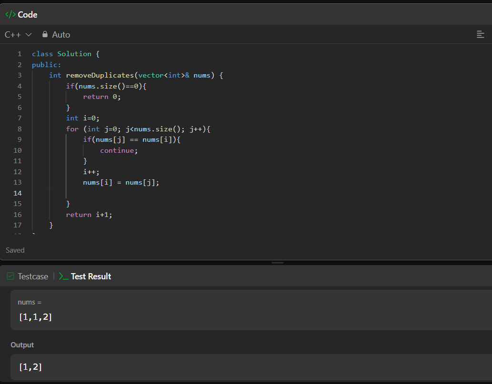

#Day 1 - (remove duplicates from sorted array)

##Date - 
22/03/26

##Problem - 
remove duplicates from sorted array

##Approach -
initially i checked if length of nums should not be zero by applying a base condition 
then i initialized a pointer i as mentioned to compare and stored the unique values,
thereby i took another pointer j to check if value on it is same as that of stored value in i then skip it by using continue till size of num 
and then pointer i was incremented further and i stored the unique values of j after skipping same values one by one till end of nums

##Code (C++)
'''cpp
class Solution {
public:
    int removeDuplicates(vector<int>& nums) {
        if(nums.size()==0){
            return 0;
        }
        int i=0;
        for (int j=0; j<nums.size(); j++){
            if(nums[j] == nums[i]){
                continue;
            }
            i++;    
            nums[i] = nums[j];
            
        } 
        return i+1;       
    }
};
'''
##Screenshot of accepted solution

